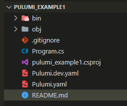

# pulumi_example1

## 概要

とりあえず Pulumi を触ってみる。

### [Pulumi](https://www.pulumi.com/) (プルミ)  
* オープンソースの IaC (Infrastructure as Code) ツール
* Terraform の HCL のような独自言語ではなく、使い慣れた言語 (TypeScript, Python, Go, C#, Java, YAML) で記述できる
* 詳しくは以下のサイトがわかりやすい  
  [Pulumiで始めるIaC入門](https://future-architect.github.io/articles/20230426a/)

## 結論
* Pulumi はやりたい事とアンマッチだった。
* 勝手にクラウドだけでなく、Hyper-V や VirtualBox などローカルの仮想化環境にも対応してるだろうと考えていたが、対応していなかった。
* ※ Docker や Kubernetes には対応しているので、恐らく DockerDesktop や Minikube などと組み合わせて環境を用意すればローカルでも使えると思われる。  
しかし Pulumi を試していた理由が、環境構築に慣れてない人に、使い慣れた言語で構築できるならハードルが下がるかなと思ってのことだったので、Pulumi を使うための環境構築が必用では本末転倒だった😫

## 導入

```
winget install Pulumi.Pulumi
```

```
> pulumi version  
v3.112.0
```

### 重要
デフォルトでは諸々の設定情報をクラウドに保持する設定のため、  
コマンドを使おうとすると Pulumi へのログイン画面が表示されてしまう。

上記を好まない私のような人は以下のコマンドを実行すること
```
pulumi login --local
```

## C# (.NET Core) で動かしてみる

[Pulumi & C#, VB, F# (.NET)](https://www.pulumi.com/docs/languages-sdks/dotnet/)

```
> dotnet --version
8.0.202
```

とりあえず `pulumi new csharp --force` を実行してみた。  
各設定は全てデフォルト (何も入力せずエンター連打)  
なお、`--force` を付けたのは、既に README.md ファイルを作った後で、実行したら出力先が空ではないと怒られたため。
```
> pulumi new csharp --force
This command will walk you through creating a new Pulumi project.

Enter a value or leave blank to accept the (default), and press <ENTER>.
Press ^C at any time to quit.

project name (pulumi_example1):
project description (A minimal C# Pulumi program):
Created project 'pulumi_example1'

stack name (dev):
Created stack 'dev'
Enter your passphrase to protect config/secrets:
Re-enter your passphrase to confirm:

Installing dependencies...

MSBuild のバージョン 17.9.6+a4ecab324 (.NET)
  復元対象のプロジェクトを決定しています...
  C:\Users\user\Desktop\Projects\pulumi_example1\pulumi_example1.csproj を復元しました (10.19 sec)。
  pulumi_example1 -> C:\Users\user\Desktop\Projects\pulumi_example1\bin\Debug\net6.0\pulumi_example1.dll

ビルドに成功しました。
    0 個の警告
    0 エラー

経過時間 00:00:14.41

ワークロードの更新が利用可能です。詳細については、`dotnet workload list` を実行してください。
Finished installing dependencies

Your new project is ready to go! 

To perform an initial deployment, run `pulumi up`
```

実行後の状態  
※README.md は私が追加したもの  


## あれ？Pulumi は Hyper-V や VirtualBox に非対応？

Hyper-V や VirtualBox へのプロビジョニングに使いたかったのだが、調べても公式にも周辺のブログ記事にもそれと思われる記述は発見できず...  
一応、GitHub に個人？で作成したと思われる [mariannegru/pulumi-virtualbox - Pulumi Virtualbox provider](https://github.com/mariannegru/pulumi-virtualbox) は発見したが、ちょっと怖くて試せなかった。  
念のため perplexity で聞いてみた。

### 質問
IaC の Pulumi について質問です。
デプロイ先に VirtualBox や Hyper-V などローカル環境にある仮想化ソフトを指定して VM 作成に利用することはできませんか？

### 回答　※ perplexity CLAUDE 3 OPUS

Pulumiは主にパブリッククラウドやKubernetesなどのクラウド環境へのインフラ構築に特化したIaCツールです。VirtualBoxやHyper-Vなどのローカル仮想化環境へのVM作成には直接対応していません[2]。

ローカル仮想化環境へのVM作成を自動化したい場合は、以下のような選択肢が考えられます:

- Vagrantを使う: VirtualBoxやHyper-Vなどの仮想化プラットフォーム上にVMを構築・プロビジョニングできるツールです。設定ファイルを書くことでVM作成を自動化できます[1]。

- シェルスクリプトやAnsibleなどの構成管理ツールを使う: APIがあればそれを呼び出してVM作成を自動化する方法です。ただしVirtualBoxなどはAPIを提供していないため、コマンドラインから操作する必要があります。

- TerraformのvSphere Providerを使う: オンプレミス環境のvSphere上にVMを構築できます。ただしVMware環境が必要です[5]。

Pulumiの主な使い道はあくまでもクラウドリソースの構築自動化なので、ローカル仮想化環境の構築には別のツールを検討するのがよいでしょう。用途に合わせて適切なツールを選択することが肝要です。

Citations:
[1] https://www.oracle.com/jp/virtualization/virtualbox/
[2] https://thinkit.co.jp/article/21057
[3] https://future-architect.github.io/articles/20230426a/
[4] https://zenn.dev/yuta28/articles/pulumi-ai-revolutionary
[5] https://cn.teldevice.co.jp/blog/p47441/

### はい😫